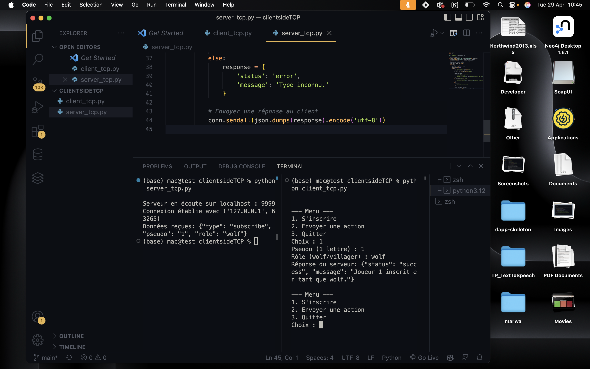

# Jeu Client-Serveur TCP

Ce projet implémente un jeu interactif où les joueurs (loup ou villageois) interagissent avec un serveur en utilisant des connexions TCP.

## Installation

### Prérequis

- Python 3.x

### Étapes d'installation

1. Clonez ce projet sur votre machine :

   ```bash
   git clone https://github.com/ilyaslahfaouti/client_TCP.git
   cd client_TCP

Lancez le serveur :

python server_tcp.py

Vous devriez voir ce message dans le terminal indiquant que le serveur est en écoute :
Serveur en écoute sur localhost : 9999


Lancez le client :

python client_tcp.py


Vous verrez un menu dans le terminal comme celui-ci :

    --- Menu ---
1. S'inscrire
2. Envoyer une action
3. Quitter
Choix :



